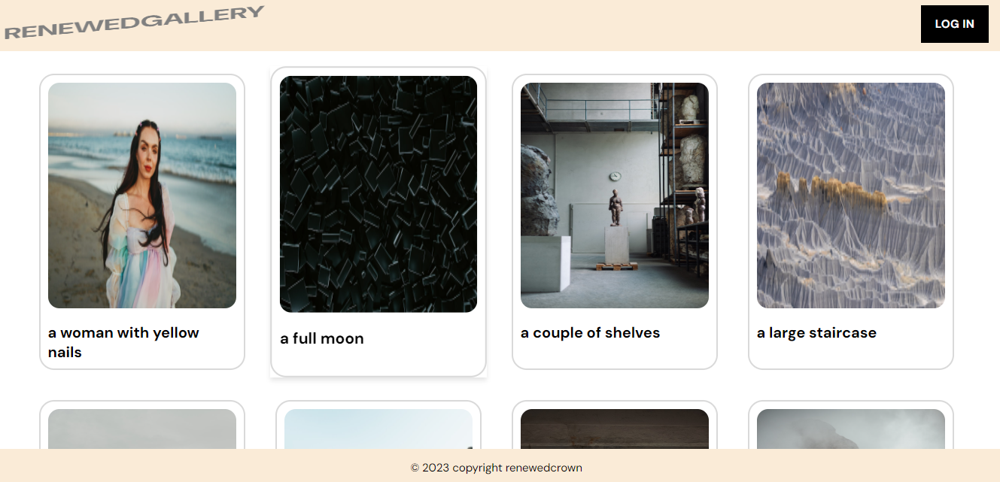
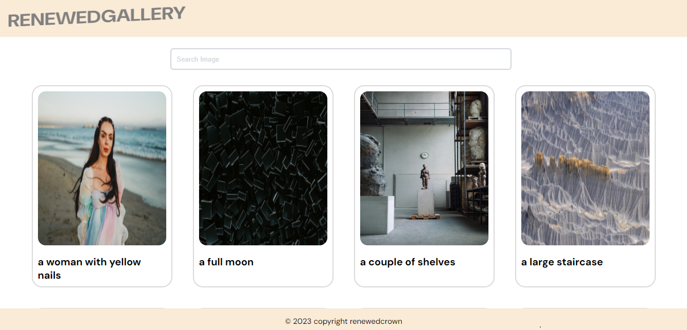

# Image Gallery Application


## Description

The Image Gallery Application is a web-based platform that allows users to browse, search, and organize a collection of images. Users can sign in to access additional features such as searching for images by tags and rearranging the order of images. The application is built using React and utilizes the `react-beautiful-dnd` library for drag-and-drop functionality.

## Features

- Browse a collection of images with tags.
- Search for images by entering keywords in the search bar.
- Rearrange the order of images using drag-and-drop functionality.
- Firebase is used for User authentication for enhanced functionality.
- Hover effect on images to prompt users to log in for more features.

## Screenshots


_Caption for Screenshot 1_


_Caption for Screenshot 2_

## Installation

1. Clone the repository to your local machine:

   ```bash
   git clone https://github.com/your-username/image-gallery.git
   ```

2. Install the required dependencies:
   npm install

3.Start the development server:
npm start

## Usage

- When you first visit the application, you can only browse the images without signing in. Hover over the images to see a prompt encouraging you to log in for more functionality.

- After Logging in the the required details( the details in the instruction given), you will gain access to advanced features such as:

-Using the search bar to search for images by tags.
-Rearranging the order of images by dragging and dropping them within the gallery.

## Technologies Used

- React
- React Beautiful DND
- Firebase (for user authentication)
- SCSS (for styling)

## License

This project is licensed under the MIT License - see the LICENSE file for details.

## Acknowledgments

Special thanks to the React Beautiful DND library for providing drag-and-drop functionality.
Icons used in this project are from FontAwesome.
The sample images and data are for demonstration purposes only and are not licensed for commercial use

## Author
- RenewedCrown